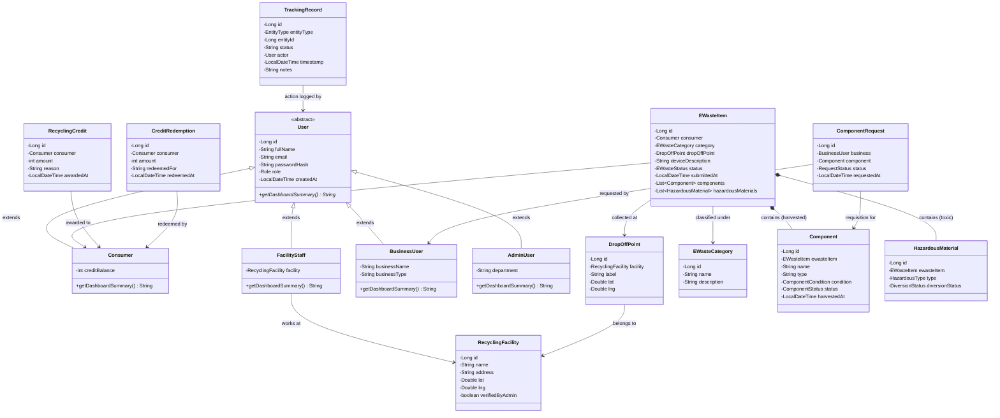

# E-Waste Recycling & Component Tracking Platform

A robust, textbook-correct Spring Boot 3 REST API backend written in Java 17 designed for an **E-Waste Recycling & Component Tracking Platform**. The platform drives circular economy initiatives by tracking discarded electronic items, salvaging functional components for secondary markets, ensuring safe diversion of toxic materials from landfills, and incentivizing consumer recycling through rewards.

---

## Technology Stack

- **Java Version**: Java 17 (LTS)
- **Framework**: Spring Boot 3.3.4
- **Persistence & ORM**: Spring Data JPA / Hibernate 6
- **Database**: H2 In-Memory Database (zero configuration, automatic schema DDL, pre-seeded data)
- **Security & Auth**: Spring Security 6 + JJWT (0.12.6) for stateless token authentication
- **API Documentation**: SpringDoc OpenAPI 3 / Swagger UI (`/swagger-ui.html`)
- **Testing**: JUnit 5, Mockito, Spring Security Test, MockMvc
- **Build Tool**: Apache Maven

---

## Quick Start Instructions

### Prerequisites
- JDK 17 or higher
- Apache Maven 3.8+

### Running the Application Locally
Clone the repository and run from the workspace root:

```bash
mvn spring-boot:run
```

The application will start on port **8080**.

- **Swagger UI**: [http://localhost:8080/swagger-ui.html](http://localhost:8080/swagger-ui.html)
- **OpenAPI 3 JSON Specification**: [http://localhost:8080/v3/api-docs](http://localhost:8080/v3/api-docs)
- **H2 Database Web Console**: [http://localhost:8080/h2-console](http://localhost:8080/h2-console)
  - JDBC URL: `jdbc:h2:mem:ewastedb`
  - Username: `sa`
  - Password: *(empty)*

### Running Unit & Integration Tests
```bash
mvn test
```

---

## Pre-Seeded Demonstration Accounts

On startup (`CommandLineRunner` in `DataSeeder`), the database automatically seeds:

| Role | Email | Password | Details |
| :--- | :--- | :--- | :--- |
| **Admin** | `admin@ewaste.org` | `admin123` | Executive Board & Compliance |
| **Facility Staff** | `staff@greentech.org` | `staff123` | GreenTech Recycling Center |
| **Consumer 1** | `alice@example.com` | `pass123` | Alice Green (Initial credits: 100) |
| **Consumer 2** | `bob@example.com` | `pass123` | Bob Clean (Initial credits: 50) |
| **Business User** | `contact@circularelectronics.com` | `biz123` | Circular Electronics Inc. (Refurbisher) |

*Pre-seeded items*: 2 sample e-waste submissions (`SUBMITTED` status) submitted by Alice and Bob with initial tracking records.

---

## OOP Principles Demonstrated

| OOP Principle | Relevant Class / Interface | One-Line Explanation |
| :--- | :--- | :--- |
| **Encapsulation** | `User`, `Consumer`, `EWasteItem`, `Component`, `HazardousMaterial`, `TrackingRecord`, etc. | All entity fields are declared strictly `private` with state access and mutations governed through public accessors and validated mutators. |
| **Inheritance** | `User` (Abstract Base Class), `Consumer`, `FacilityStaff`, `BusinessUser`, `AdminUser` | Base `User` class encapsulates common identity, email, password hash, and audit fields, extended by specialized child classes using JPA `JOINED` inheritance. |
| **Polymorphism** | `User.getDashboardSummary()` | The abstract method `getDashboardSummary()` declared on `User` is overridden with distinct behaviors in `Consumer`, `FacilityStaff`, `BusinessUser`, and `AdminUser` to yield role-tailored dashboard summaries. |
| **Abstraction** | `TrackingService`, `CreditService`, `ConsumerService`, `FacilityService`, `BusinessService`, `AdminService`, `CreditStrategy` | Clean separation of contract from implementation where business capabilities are defined in public interfaces, completely decoupling callers from concrete implementations in `service.impl`. |
| **Composition** | `EWasteItem` | Models a structural "has-a" relationship composed of `EWasteCategory`, `DropOffPoint`, `List<Component>`, and `List<HazardousMaterial>` instead of inheritance. |
| **Strategy Pattern** | `CreditStrategy`, `StandardCreditStrategy`, `HazardousBonusCreditStrategy` | Encapsulates interchangeable credit reward calculation algorithms selected dynamically at runtime inside `CreditServiceImpl` based on the presence of hazardous materials. |
| **Builder Pattern** | `EWasteItemBuilder` | A hand-written GoF Builder pattern (no Lombok shortcuts) that provides step-by-step assembly, invariant validation, and safe defaults for constructing `EWasteItem` instances. |

---

## Entity Relationship Diagram (Mermaid)



---

## Complete API Catalog & JSON Examples

### 1. Authentication Endpoints

#### Register (`POST /api/auth/register`)
- **Access**: Public
- **Request**:
```json
{
  "fullName": "David Brown",
  "email": "david@example.com",
  "password": "securePassword123",
  "role": "CONSUMER"
}
```
- **Response (201 Created)**:
```json
{
  "token": "eyJhbGciOiJIUzM4NCJ9...",
  "type": "Bearer",
  "id": 6,
  "email": "david@example.com",
  "fullName": "David Brown",
  "role": "CONSUMER",
  "dashboardSummary": "Consumer [David Brown] - Available Recycling Credits: 0 pts"
}
```

#### Login (`POST /api/auth/login`)
- **Access**: Public
- **Request**:
```json
{
  "email": "alice@example.com",
  "password": "pass123"
}
```
- **Response (200 OK)**:
```json
{
  "token": "eyJhbGciOiJIUzM4NCJ9...",
  "type": "Bearer",
  "id": 2,
  "email": "alice@example.com",
  "fullName": "Alice Green",
  "role": "CONSUMER",
  "dashboardSummary": "Consumer [Alice Green] - Available Recycling Credits: 100 pts"
}
```

#### User Profile (`GET /api/auth/profile`)
- **Access**: Authenticated (`ROLE_CONSUMER`, `ROLE_FACILITY_STAFF`, `ROLE_BUSINESS`, `ROLE_ADMIN`)
- **Response (200 OK)**:
```json
{
  "id": 2,
  "fullName": "Alice Green",
  "email": "alice@example.com",
  "role": "CONSUMER",
  "createdAt": "2026-09-21T21:12:27.016083",
  "dashboardSummary": "Consumer [Alice Green] - Available Recycling Credits: 100 pts",
  "creditBalance": 100,
  "facilityId": null,
  "facilityName": null,
  "businessName": null,
  "businessType": null,
  "department": null
}
```

---

### 2. Public Endpoints

#### Get Categories (`GET /api/categories`)
- **Access**: Public
- **Response (200 OK)**:
```json
[
  {
    "id": 1,
    "name": "Laptop",
    "description": "Portable computers, ultrabooks, and notebooks"
  },
  {
    "id": 2,
    "name": "Smartphone",
    "description": "Mobile cellular phones, phablets, and tablets"
  }
]
```

#### Get Drop-Off Points (`GET /api/drop-off-points`)
- **Access**: Public
- **Response (200 OK)**:
```json
[
  {
    "id": 1,
    "label": "Downtown Public Drop Box A",
    "lat": 37.775,
    "lng": -122.418,
    "facilityId": 1,
    "facilityName": "GreenTech Recycling Center"
  }
]
```

---

### 3. Consumer Endpoints (`ROLE_CONSUMER`)

#### Submit E-Waste Item (`POST /api/consumer/ewaste-items`)
- **Access**: Bearer Token (`ROLE_CONSUMER`)
- **Request**:
```json
{
  "categoryId": 1,
  "dropOffPointId": 1,
  "deviceDescription": "Lenovo ThinkPad X1 Carbon with broken display"
}
```
- **Response (201 Created)**:
```json
{
  "id": 3,
  "consumerId": 2,
  "consumerName": "Alice Green",
  "categoryId": 1,
  "categoryName": "Laptop",
  "dropOffPointId": 1,
  "dropOffPointLabel": "Downtown Public Drop Box A",
  "deviceDescription": "Lenovo ThinkPad X1 Carbon with broken display",
  "status": "SUBMITTED",
  "submittedAt": "2026-09-21T21:13:15.773327",
  "componentCount": 0,
  "hazardousMaterialCount": 0
}
```

#### Get My Submissions (`GET /api/consumer/ewaste-items`)
- **Access**: Bearer Token (`ROLE_CONSUMER`)
- **Response (200 OK)**: List of consumer's submitted items.

#### Get Item Tracking Timeline (`GET /api/consumer/ewaste-items/{id}/tracking`)
- **Access**: Bearer Token (`ROLE_CONSUMER`)
- **Response (200 OK)**:
```json
[
  {
    "id": 3,
    "entityType": "EWASTE_ITEM",
    "entityId": 3,
    "status": "SUBMITTED",
    "actorId": 2,
    "actorName": "Alice Green",
    "actorEmail": "alice@example.com",
    "timestamp": "2026-09-21T21:13:15.774151",
    "notes": "E-waste device registered in system for intake"
  },
  {
    "id": 4,
    "entityType": "EWASTE_ITEM",
    "entityId": 3,
    "status": "RECEIVED",
    "actorId": 4,
    "actorName": "John Tech",
    "actorEmail": "staff@greentech.org",
    "timestamp": "2026-09-21T21:13:15.820112",
    "notes": "Item received and checked in at facility: GreenTech Recycling Center"
  }
]
```

#### Get Credits (`GET /api/consumer/credits`)
- **Access**: Bearer Token (`ROLE_CONSUMER`)
- **Response (200 OK)**:
```json
[
  {
    "id": 1,
    "amount": 120,
    "reason": "Recycling credit for salvaged component: 16GB DDR4 SODIMM RAM",
    "awardedAt": "2026-09-21T21:13:15.975475"
  }
]
```

#### Redeem Credits (`POST /api/consumer/credits/redeem`)
- **Access**: Bearer Token (`ROLE_CONSUMER`)
- **Request**:
```json
{
  "amount": 50,
  "redeemedFor": "$15 Green Coffee Voucher"
}
```
- **Response (200 OK)**:
```json
{
  "id": 1,
  "amount": 50,
  "redeemedFor": "$15 Green Coffee Voucher",
  "redeemedAt": "2026-09-21T21:13:16.006406",
  "remainingBalance": 170
}
```

---

### 4. Facility Staff Endpoints (`ROLE_FACILITY_STAFF`)

#### Intake Queue (`GET /api/facility/ewaste-items?status=SUBMITTED`)
- **Access**: Bearer Token (`ROLE_FACILITY_STAFF`)
- **Response (200 OK)**: List of items awaiting check-in.

#### Receive Item (`PUT /api/facility/ewaste-items/{id}/receive`)
- **Access**: Bearer Token (`ROLE_FACILITY_STAFF`)
- **Response (200 OK)**: Item with status updated to `RECEIVED`.

#### Categorize Item (`PUT /api/facility/ewaste-items/{id}/categorize`)
- **Access**: Bearer Token (`ROLE_FACILITY_STAFF`)
- **Request**:
```json
{
  "categoryId": 1,
  "triageNotes": "Verified ThinkPad X1 Carbon. Screen and keyboard functional."
}
```
- **Response (200 OK)**: Item with status updated to `CATEGORIZED`.

#### Harvest Component (`POST /api/facility/ewaste-items/{id}/components`)
- **Access**: Bearer Token (`ROLE_FACILITY_STAFF`)
- **Description**: Creates a `Component` entity in status `AVAILABLE`, triggers `CreditStrategy` to auto-award credits to the consumer, and creates immutable `TrackingRecord`s.
- **Request**:
```json
{
  "name": "16GB DDR4 SODIMM RAM",
  "type": "RAM",
  "condition": "GOOD"
}
```
- **Response (201 Created)**:
```json
{
  "id": 2,
  "ewasteItemId": 3,
  "categoryName": "Laptop",
  "name": "16GB DDR4 SODIMM RAM",
  "type": "RAM",
  "condition": "GOOD",
  "status": "AVAILABLE",
  "harvestedAt": "2026-09-21T21:13:15.970828"
}
```

#### Flag Hazardous Material (`POST /api/facility/ewaste-items/{id}/hazardous-materials`)
- **Access**: Bearer Token (`ROLE_FACILITY_STAFF`)
- **Request**:
```json
{
  "type": "BATTERY"
}
```
- **Response (201 Created)**:
```json
{
  "id": 2,
  "ewasteItemId": 3,
  "type": "BATTERY",
  "diversionStatus": "FLAGGED"
}
```

#### Divert Hazardous Material (`PUT /api/facility/hazardous-materials/{id}/divert`)
- **Access**: Bearer Token (`ROLE_FACILITY_STAFF`)
- **Response (200 OK)**:
```json
{
  "id": 2,
  "ewasteItemId": 3,
  "type": "BATTERY",
  "diversionStatus": "DIVERTED"
}
```

#### Update Component Requisition Status (`PUT /api/facility/component-requests/{id}/status`)
- **Access**: Bearer Token (`ROLE_FACILITY_STAFF`)
- **Request**:
```json
{
  "status": "FULFILLED"
}
```
- **Response (200 OK)**: Updated `ComponentRequestResponse` with `FULFILLED` status.

---

### 5. Business Marketplace Endpoints (`ROLE_BUSINESS`)

#### Search Available Components (`GET /api/business/components?status=AVAILABLE`)
- **Access**: Bearer Token (`ROLE_BUSINESS`)
- **Response (200 OK)**: List of harvested components available for reuse.

#### Request Component (`POST /api/business/component-requests`)
- **Access**: Bearer Token (`ROLE_BUSINESS`)
- **Request**:
```json
{
  "componentId": 2
}
```
- **Response (201 Created)**:
```json
{
  "id": 1,
  "businessId": 5,
  "businessName": "Circular Electronics Inc.",
  "componentId": 2,
  "componentName": "16GB DDR4 SODIMM RAM",
  "componentType": "RAM",
  "componentCondition": "GOOD",
  "status": "PENDING",
  "requestedAt": "2026-09-21T21:13:16.109066"
}
```

#### Get My Requisitions (`GET /api/business/component-requests`)
- **Access**: Bearer Token (`ROLE_BUSINESS`)
- **Response (200 OK)**: List of component requests initiated by the business.

---

### 6. Admin Oversight Endpoints (`ROLE_ADMIN`)

#### List Facilities (`GET /api/admin/facilities`)
- **Access**: Bearer Token (`ROLE_ADMIN`)
- **Response (200 OK)**: List of registered facilities.

#### Verify Facility (`PUT /api/admin/facilities/{id}/verify`)
- **Access**: Bearer Token (`ROLE_ADMIN`)
- **Request**:
```json
{
  "verified": true
}
```
- **Response (200 OK)**: Updated `FacilityResponse` with `verifiedByAdmin: true`.

---

## Postman Collection

A complete Postman v2.1 collection is exported to:
- [`docs/postman_collection.json`](file:///home/ahmed/Projects/ewastetracking/docs/postman_collection.json)

Import the file directly into Postman. Requests are organized by role and lifecycle step with pre-request authentication variables automatically handled.
